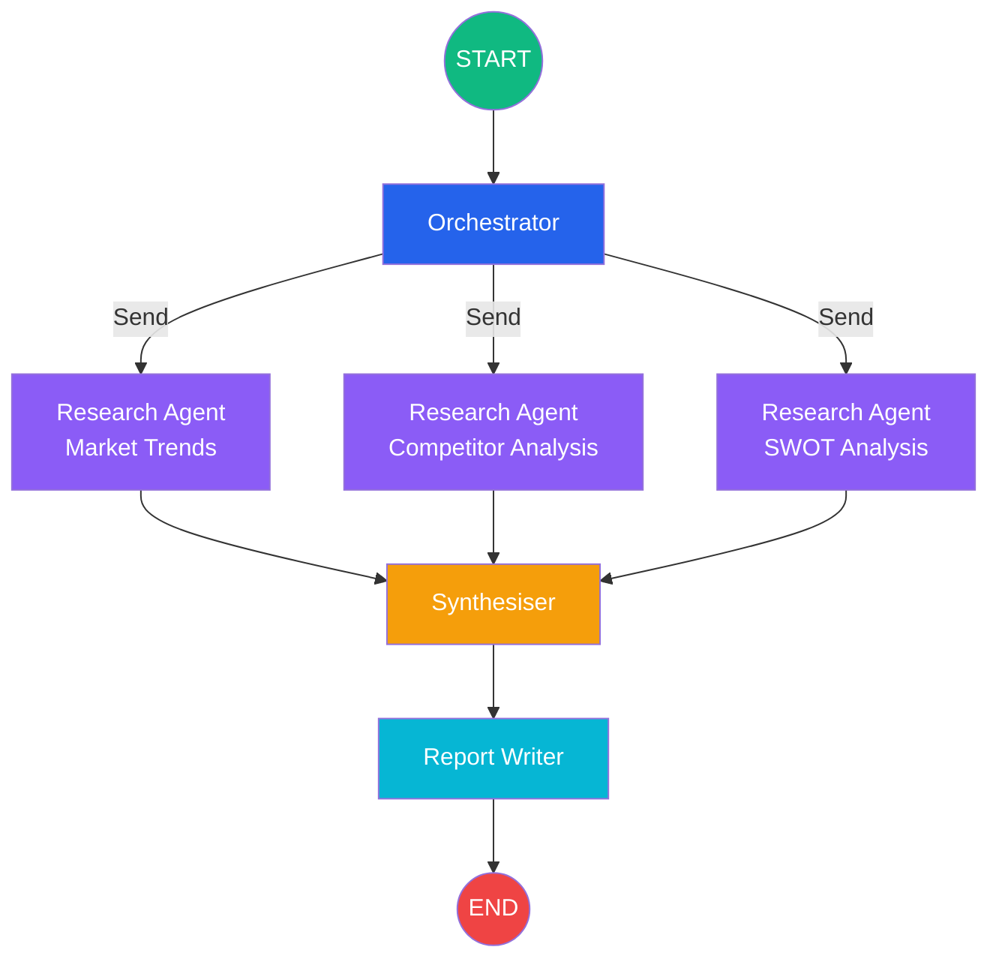

# Architecture

## System Overview

The **Deep Research Analyst** is an autonomous multi-agent system built on
[LangGraph](https://github.com/langchain-ai/langgraph). Given a research topic,
it orchestrates several specialised sub-agents that search the web, analyse
findings, synthesise an executive report, and render it as a self-contained HTML
document.

## Graph Topology



## Node Descriptions

### Orchestrator (`src/nodes/orchestrator.py`)

* **Purpose:** Accepts the user topic, plans the sub-sections, and dispatches
  parallel `Send()` commands to the research agents.
* **Input:** `ResearchState` with `topic` and optional `sub_topics`.
* **Output:** Updated `sub_topics` list + `Send()` dispatch via the router.

### Research Agent (`src/nodes/research_agent.py`)

* **Purpose:** Each instance performs multi-round recursive web search via Tavily,
  then synthesises the raw hits into a structured Markdown section with the LLM.
* **Input:** `SubAgentInput` (topic, section_name, search_depth).
* **Output:** An `AgentResult` dict appended to `agent_results`.

### Synthesiser (`src/nodes/synthesiser.py`)

* **Purpose:** Consumes **all** agent results (accumulated via `operator.add`)
  and produces a unified executive summary highlighting cross-cutting themes,
  conflicts, and strategic recommendations.
* **Input:** `agent_results` list + `topic`.
* **Output:** `synthesis` string.

### Report Writer (`src/nodes/report_writer.py`)

* **Purpose:** Generates Matplotlib charts from `chart_data`, builds a
  self-contained HTML report with base64-embedded images, and writes it to disk.
* **Input:** Full `ResearchState`.
* **Output:** `report_path` string.

## Data Flow

```
User Topic
    │
    ▼
┌──────────────┐
│ Orchestrator  │  plans sub-sections
└──────┬───────┘
       │ Send() × N
       ▼
┌──────────────┐   Tavily recursive search
│ Research      │─→ LLM section synthesis
│ Agent (×N)   │─→ chart_data extraction
└──────┬───────┘
       │ agent_results (operator.add)
       ▼
┌──────────────┐
│ Synthesiser   │  executive summary
└──────┬───────┘
       │
       ▼
┌──────────────┐
│ Report Writer │  HTML + charts
└──────┬───────┘
       │
       ▼
   reports/*.html
```

## Resilience Pattern

The LLM invocation (`src/llm/provider.py :: llm_invoke`) implements:

1. **Exponential back-off** — on `429 / rate_limit` errors the system retries
   up to `retry.max_attempts` times with doubling delays.
2. **Automatic model fallback** — if the primary model is exhausted, the system
   transparently switches to the lighter fallback model.

```
primary (llama-3.3-70b) ──retry──retry──retry──→ fallback (llama-3.1-8b) ──retry──→ raise
```

## Configuration

All tuneable parameters live in `configs/settings.yaml`:

| Section   | Key                   | Description                              |
|-----------|-----------------------|------------------------------------------|
| `llm`     | `provider`            | `groq` or `openai`                       |
| `llm`     | `primary_model`       | Primary LLM model name                   |
| `llm`     | `fallback_model`      | Fallback model on rate-limit             |
| `retry`   | `max_attempts`        | Retry count per model                    |
| `retry`   | `base_delay_seconds`  | Initial back-off delay                   |
| `search`  | `max_search_rounds`   | Recursive drill-down depth               |
| `agent`   | `num_research_agents` | Number of parallel sub-agents            |
| `report`  | `output_dir`          | Where HTML reports are written           |
