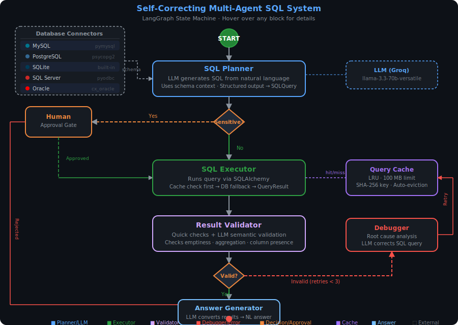

# 🏗️ Self-Correcting Multi-Agent SQL System

A **production-ready**, self-correcting SQL agent built with [LangGraph](https://langchain-ai.github.io/langgraph/), [LangChain](https://python.langchain.com/), and [SQLAlchemy 2.x](https://docs.sqlalchemy.org/).

Ask questions in **natural language** → the agent generates SQL, executes it, validates the results, and auto-corrects on failure — all through a multi-node state machine with human-in-the-loop approval for sensitive queries.

---

## ✨ Features

| Feature | Description |
|---------|-------------|
| 🧠 **LLM-powered SQL generation** | Converts natural language → SQL using Groq / OpenAI |
| 🔁 **Self-correction loop** | Debugger node analyses failures, rewrites SQL, retries (up to 3×) |
| ✅ **Two-stage validation** | Quick programmatic checks + LLM semantic validation |
| ⚠️ **Human approval gate** | Sensitive DML/DDL queries require explicit user consent |
| 📦 **LRU query cache** | SHA-256 keyed, 100 MB memory-bounded, auto-evicting |
| 🗄️ **Multi-dialect support** | MySQL, PostgreSQL, SQLite, SQL Server, Oracle |
| 💬 **Interactive CLI** | REPL with `cache` stats and `q` to quit |
| 🧩 **Modular architecture** | One module per concern — easy to test and extend |

---

## 🔄 Workflow

> **Hover** over any block in the SVG to see a tooltip description (works in browsers & GitHub).

<p align="center">
  
</p>

---

## �📁 Project Structure

```
Self Correction Multi Agent System/
├── .env                    # secrets (git-ignored)
├── .env.example            # template for .env
├── pyproject.toml          # project metadata & dependencies
├── README.md
├── configs/
│   └── settings.yaml       # tuneable parameters
├── notebooks/              # thin notebooks that import src/
├── src/
│   ├── __init__.py          # top-level convenience imports
│   ├── models/
│   │   ├── __init__.py
│   │   ├── schemas.py       # Pydantic models (SQLQuery, QueryResult, …)
│   │   └── state.py         # AgentState TypedDict
│   ├── db/
│   │   ├── __init__.py
│   │   ├── cache.py         # QueryCache (LRU, SHA-256, 100 MB)
│   │   └── manager.py       # DatabaseManager (engines, schema, execute)
│   ├── llm/
│   │   ├── __init__.py
│   │   └── provider.py      # get_llm() factory — swap providers here
│   ├── nodes/
│   │   ├── __init__.py
│   │   ├── planner.py       # SQL Planner (NL → SQL)
│   │   ├── approval.py      # Human Approval gate
│   │   ├── executor.py      # SQL Executor (run + cache)
│   │   ├── validator.py     # Result Validator (quick + LLM)
│   │   ├── debugger.py      # Debugger (root-cause → corrected SQL)
│   │   └── answer.py        # Answer Generator (results → NL)
│   ├── routing/
│   │   ├── __init__.py
│   │   └── decisions.py     # Conditional-edge routing functions
│   ├── graph/
│   │   ├── __init__.py
│   │   └── builder.py       # build_sql_agent_graph + compile_graph
│   └── cli/
│       ├── __init__.py
│       └── interactive.py   # run_agent() + interactive REPL
└── tests/
    ├── __init__.py
    ├── test_schemas.py
    ├── test_cache.py
    └── test_routing.py
```

---

## 🏛️ Architecture

```
START ──► Planner ──► Sensitive? ──Yes──► Human Approval ──► Approved? ──Yes──► Executor
                            │                                     │ No
                            │ No                                  └──────► END
                            ▼
                        Executor ──► Validator ──► Valid? ──Yes──► Answer ──► END
                                                       │ No (retries left)
                                                       ▼
                                                   Debugger ──► Executor (retry)
```

---

## 🚀 Quick Start

### 1. Clone & install

```bash
cd "Self Correction Multi Agent System"
python -m venv .venv && source .venv/bin/activate
pip install -e ".[dev,mysql]"       # add postgres/mssql/oracle as needed
```

### 2. Configure secrets

```bash
cp .env.example .env
# Edit .env — set GROQ_API_KEY and your connection string(s)
```

### 3. Run the interactive CLI

```bash
sql-agent                           # uses the entry-point in pyproject.toml
# — or —
python -m src.cli.interactive
```

### 4. Use as a library

```python
from src import run_agent

result = run_agent("Show the top 10 customers by revenue", dialect="MySQL")
print(result["answer"])
print(result["sql"].query)
```

---

## 🧪 Running Tests

```bash
pytest tests/ -v
```

---

## ⚙️ Configuration

| Setting | Location | Default |
|---------|----------|---------|
| LLM provider / model | `src/llm/provider.py` or `.env` | Groq `llama-3.3-70b-versatile` |
| Cache size | `configs/settings.yaml` | 100 MB |
| Max retries | `configs/settings.yaml` | 3 |
| DB connection strings | `.env` | See `.env.example` |

---

## 🔌 Swapping the LLM Provider

Edit `.env`:

```env
# Switch to OpenAI
OPENAI_API_KEY=sk-...
LLM_MODEL=gpt-4o-mini
```

Then update `src/llm/provider.py` or call:

```python
from src.llm.provider import get_llm
llm = get_llm(provider="openai", model="gpt-4o-mini")
```

---

## 📜 License

MIT
